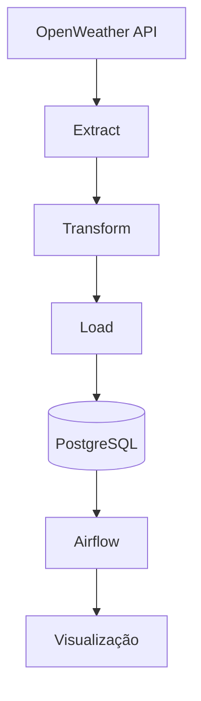

# **Projeto: Pipeline de Qualidade do Ar com Apache Airflow**

Este projeto é um pipeline ETL (Extract, Transform, Load) que coleta dados de qualidade do ar de todas as capitais brasileiras usando a API do [OpenWeatherMap](https://openweathermap.org/api/air-pollution), transforma os dados e os carrega em um banco de dados PostgreSQL. O pipeline é orquestrado pelo Apache Airflow, permitindo execuções automatizadas e monitoramento.

---

## **📌 Sumário**
- [**Projeto: Pipeline de Qualidade do Ar com Apache Airflow**](#projeto-pipeline-de-qualidade-do-ar-com-apache-airflow)
  - [**📌 Sumário**](#-sumário)
  - [**🌐 Visão Geral**](#-visão-geral)
  - [**🚀 Funcionalidades**](#-funcionalidades)
  - [**🛠 Tecnologias Utilizadas**](#-tecnologias-utilizadas)
  - [**📂 Estrutura do Projeto**](#-estrutura-do-projeto)
  - [**📐 Arquitetura**](#-arquitetura)
  - [**📋 Pré-requisitos**](#-pré-requisitos)
  - [**⚙ Configuração do Ambiente**](#-configuração-do-ambiente)
  - [**▶ Executando o Projeto**](#-executando-o-projeto)
  - [**📄 Explicação dos Arquivos**](#-explicação-dos-arquivos)
  - [**📞 Contato**](#-contato)

---

## **🌐 Visão Geral**
O projeto tem como objetivo monitorar a qualidade do ar em todas as capitais brasileiras. Ele coleta dados da API do OpenWeatherMap, transforma esses dados em um formato adequado e os armazena em um banco de dados PostgreSQL. O Apache Airflow é usado para orquestrar o pipeline, permitindo execuções automatizadas e monitoramento.

---

## **🚀 Funcionalidades**
- **Extração de Dados**: Coleta dados de qualidade do ar de todas as capitais brasileiras.
- **Transformação de Dados**: Converte os dados brutos em um formato estruturado.
- **Carga de Dados**: Armazena os dados transformados em um banco de dados PostgreSQL.
- **Orquestração**: Usa o Apache Airflow para agendar e monitorar o pipeline.
- **Logging**: Registra mensagens de log para facilitar a depuração e o monitoramento.

---

## **🛠 Tecnologias Utilizadas**
- **Python**: Linguagem de programação principal.
- **Apache Airflow**: Orquestração do pipeline.
- **PostgreSQL**: Armazenamento dos dados.
- **Docker**: Contêinerização do banco de dados e do Airflow.
- **API do OpenWeatherMap**: Fonte dos dados de qualidade do ar.
- **Pandas**: Manipulação de dados.
- **Psycopg2**: Conexão com o PostgreSQL.
- **Requests**: Requisições HTTP para a API.

---

## **📂 Estrutura do Projeto**
```
air_quality_pipeline/
│── .env                  # Variáveis de ambiente
│── .gitignore            # Arquivos e diretórios ignorados pelo Git
│── docker-compose.yml    # Configuração do PostgreSQL e Airflow
│── requirements.txt      # Dependências do projeto
│── README.md             # Documentação do projeto
│── main.py               # Script principal do pipeline
│── extraction.py         # Extração de dados da API
│── transform.py          # Transformação dos dados
│── load.py               # Carga dos dados no PostgreSQL
│── db.py                 # Conexão com o PostgreSQL
│── utils.py              # Configuração do load_dotenv e logging
│── logs/                 # Arquivos de log
│── airflow/
│   └── dags/
│       └── etl.py        # DAG do Apache Airflow
|── air_quality_dashboard.pbix
```
---
## **📐 Arquitetura**

---

## **📋 Pré-requisitos**
- **Docker**: Para rodar o PostgreSQL e o Apache Airflow.
- **Python 3.8+**: Para executar o pipeline.
- **Conta no OpenWeatherMap**: Para obter uma chave de API.

---

## **⚙ Configuração do Ambiente**
1. **Clone o repositório**:
   ```bash
   git clone https://github.com/seu-usuario/air_quality_pipeline.git
   cd air_quality_pipeline
   ```

2. **Crie um arquivo `.env`**:
   - Renomeie o arquivo `.env-example` para `.env`.
   - Adicione sua chave de API do OpenWeatherMap e as credenciais do banco de dados.

3. **Instale as dependências**:
   ```bash
   pip install -r requirements.txt
   ```

4. **Inicie o PostgreSQL e o Airflow**:
   ```bash
   docker-compose up -d
   ```

---

## **▶ Executando o Projeto**
   1. Via Airflow (recomendado):
      - Acesse http://localhost:8080
      - Ative a DAG air_quality_etl

   2. Manual:
      ```bash
      python main.py
      ```

Acessando os Dados
   - PGAdmin: http://localhost:5050
      - Credenciais definidas no .env

   - Consulta Direta:
      ```sql
      SELECT city, air_quality_index 
      FROM air_quality 
      WHERE date = CURRENT_DATE;
      ```
Verifique os logs:
   - Os logs são armazenados na pasta `logs/`.

---

## **📄 Explicação dos Arquivos**
- **`.env`**: Armazena variáveis de ambiente, como chave de API e credenciais do banco de dados.
- **`docker-compose.yml`**: Configura o PostgreSQL e o Apache Airflow em contêineres Docker.
- **`main.py`**: Script principal que executa o pipeline ETL.
- **`extract.py`**: Extrai dados da API do OpenWeatherMap.
- **`transform.py`**: Transforma os dados brutos em um formato estruturado.
- **`load.py`**: Carrega os dados transformados no PostgreSQL.
- **`db.py`**: Gerencia a conexão com o banco de dados.
- **`airflow/dags/etl.py`**: Define a DAG do Apache Airflow para orquestrar o pipeline.
- **`utils.py`**: Contém a configuração do load_dotenv e logging.

---

## **📞 Contato**
- **Linkedin**: [Giovana Hoffmann](www.linkedin.com/in/giovana-hoffmann-a53987255)

